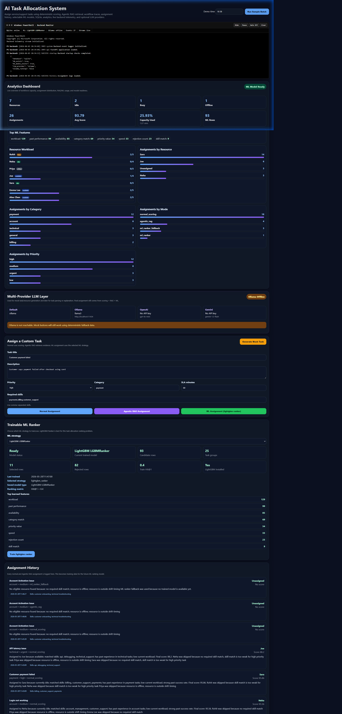
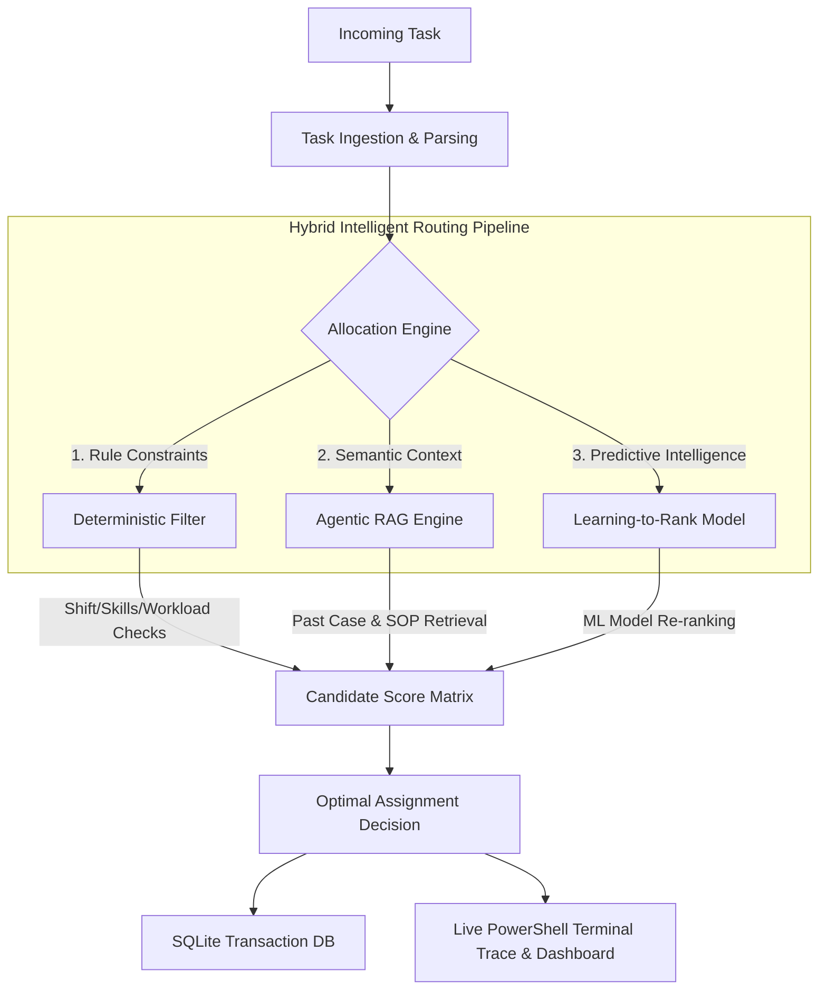
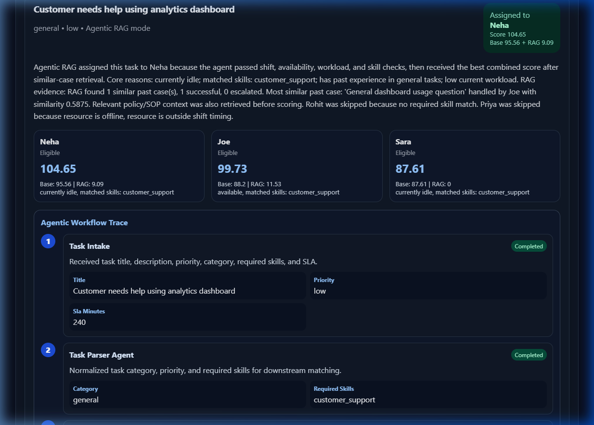
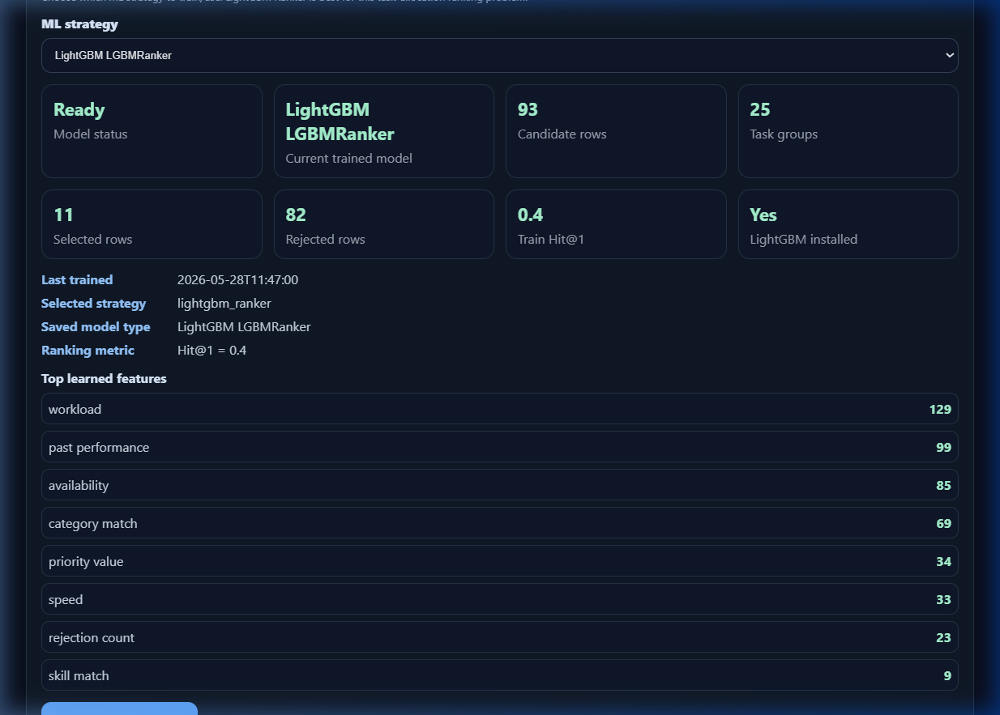

# 🚀 OpsPilot- AI Task Allocation System
> **An Intelligent Workforce Assignment & Candidate Re-Ranking Platform**  
> Powered by **Agentic RAG** 🧠 • **Learning-to-Rank (LightGBM/RF)** 📊 • **SQLite Transactional Storage** 💾 • **Ollama-powered Local LLMs** 🦙

👤 **Author:** Kartikeya ([KartikeyaM2007](https://github.com/KartikeyaM2007))

---

## 🌟 Overview
The **AI Task Allocation System** is a next-generation workforce assignment platform designed for high-throughput customer support and service environments. It bridges deterministic business rule constraints with predictive AI re-ranking and generative agent reasoning to match incoming tasks with the most qualified, available resources.

### 🖥️ Main Dashboard
Below is the live view of the dashboard displaying the PowerShell terminal trace logs, active resource workload matrices, pending tasks, and recent assignments.





---

## 🛠️ Key Architectural Pillars

### 1. 🦙 Ollama-Powered Local LLM Ingestion
Integrated with a robust, multi-provider LLM abstraction layer supporting:
* **Ollama (Default Local)**: Run state-of-the-art models like `llama3.1` or `mistral` fully local with zero API cost.
* **OpenAI & Gemini**: High-performance cloud fallbacks for production scale.
* **Mock Ingestion Engines**: Generates highly realistic, context-aware tasks and resource profiles dynamically for realistic sandbox testing.

---

### 2. 🧠 Agentic Retrieval-Augmented Generation (RAG)
For complex assignments, the `POST /assign/agentic` pipeline executes an advanced multi-agent workflow:
1. **Task Parser Agent**: Uses LLM-driven intelligence to parse unstructured titles/descriptions and extract strict categories, priority, and required skill matrices.
2. **Context Retrieval**: Pulls matching historical cases from SQLite and retrieves specific standard operating procedures (SOPs) from the knowledge base.
3. **Evidence Scoring**: Injects a dynamically calculated "RAG bonus" into the final allocation matrix based on historical resource success/escalation evidence.
4. **Scoring Engine Safeguard**: The LLM informs and explains, but the deterministic scoring engine retains final authority, ensuring 100% auditability and constraint compliance.

#### 🔍 Agentic RAG Trace & Evidence Panel
The dashboard tracks the exact reasonings, retrieved SOP guides, and calculated RAG bonuses for every routing decision:



---

### 3. 🎯 Learning-to-Rank ML Engine
The platform dynamically collects telemetry from all assignment actions, logging all eligible candidates into a structured dataset to train custom scoring models.
* **LightGBM Ranker**: Standard pairwise/listwise ranking optimal for matching group task-to-resource layouts.
* **Random Forest Classifier**: High-robustness baseline model for feature importance exploration.
* **Random Baseline**: Comparison model for testing and validation.
* **Feature Importance**: Analyzes and exposes which features (e.g., workload, speed, skill-match) most heavily influence model recommendations.

#### 📈 Model Metrics & Training Settings
Train models dynamically and check feature importances, dataset coverage, and precision hit ratios:



---

### 4. 💾 Relational SQLite Database
Replaced flat CSV storage with a robust, ACID-compliant SQLite relational persistence layer (`data/app.db`):
* Relational tables for `resources`, `tasks`, `task_history`, `past_cases`, `assignment_logs`, and `ml_training_candidates`.
* Provides lightning-fast runtime query execution while retaining CSV backups for portability.

---

### 5. 💻 Windows PowerShell-Style Live Terminal Monitor
A live, black-and-white terminal monitor positioned at the top of the frontend dashboard:
* Streams system trace events in real-time (APIs, SQLite reads/writes, LLM generation, ML training stages).
* Implements smart filters, pause/resume capability, and rate-limiting (excluding noisy health poll checks) to facilitate clean, professional live demos.

---

## ⚡ Quick Start

### 📋 Prerequisites
* Python 3.10+
* Node.js v18+
* Ollama (Optional, for offline LLM support)

---

### 1. ⚙️ Backend Setup

#### Clone & Install Dependencies
```bash
cd backend
python -m venv .venv
# On Windows PowerShell:
.venv\Scripts\activate
# On Linux/macOS:
source .venv/bin/activate

pip install -r requirements.txt
```

#### Configure Environment Variables
Copy the template `.env` and adjust the variables:
```bash
cp .env.example .env
```
Inside `backend/.env`:
```env
LLM_PROVIDER=ollama
OLLAMA_BASE_URL=http://localhost:11434
OLLAMA_MODEL=llama3.1

# Optional cloud API keys:
OPENAI_API_KEY=
GEMINI_API_KEY=
```

#### Start Local LLM (Optional)
If using Ollama:
```bash
ollama serve
ollama pull llama3.1
```

#### Launch Backend Server
```bash
uvicorn app.main:app --reload --port 8000
```
* **API Documentation**: [http://127.0.0.1:8000/docs](http://127.0.0.1:8000/docs)
* **Database Status**: [http://127.0.0.1:8000/db/status](http://127.0.0.1:8000/db/status)

---

### 2. 🎨 Frontend Dashboard Setup

Open a second terminal window:
```bash
cd frontend
npm install
npm run dev
```
Open the local URL shown in your terminal (usually `http://localhost:5173`).

---

## 📊 Allocation Logic Blueprint

For every incoming task, candidate resources are checked against deterministic filters and ranked:

### Pre-Scoring Hard Rejections
* **Offline Status**: Candidate must be active.
* **Shift Timing**: Task intake time must fall within the resource's shift windows.
* **Capacity Limit**: Candidate's current workload must be below their maximum capacity.
* **Skill Missing**: Candidate must possess the task's required core skills.

### Hybrid Score Calculation
$$Score = \text{Skills } (30\%) + \text{Availability } (20\%) + \text{Workload } (15\%) + \text{Category Match } (15\%) + \text{Performance } (10\%) + \text{Exp } (5\%) + \text{Speed } (5\%)$$

---

## 🔌 API Reference

### Allocation Endpoints
* `POST /assign` - Evaluates candidates via deterministic scoring rules.
* `POST /assign/agentic` - Runs Ollama/LLM RAG with document retrieval and explanation generation.
* `POST /assign/ml` - Re-ranks eligible candidates using the trained LightGBM/Random Forest model.

### Machine Learning
* `GET  /ml/status` - Checks training logs, dataset size, and trained model features.
* `POST /ml/train` - Trains a chosen strategy model (`?model_type=lightgbm_ranker`, `random_forest`).

### Mock Generator & Data
* `POST /mock/task` - Ingests a new realistic task using LLM generation.
* `POST /mock/resource` - Ingests a new realistic resource using LLM generation.
* `GET  /analytics/summary` - Provides aggregate data for dashboard visualization.

---

## 🤝 Contributing & License
Distributed under the MIT License. Feel free to open issues or pull requests.

*Maintained by **[Kartikeya](https://github.com/KartikeyaM2007)*** 🚀

